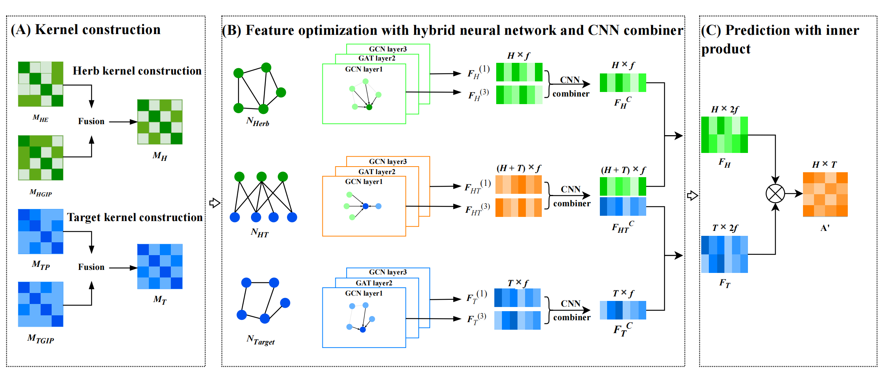

# MNHGHTA
The MNHGHTA is designed for the prediction of herb-target associations. Two kernels are constructed for herbs and for targets, respectively. They are fused into one unified herb kernel and target kernel, thereby building the herb and target similar networks. Then, the hybrid graph neural network and convolution neural network combiner are applied to above similar networks and herb-target association network for accessing high-level herb and target representations. Finally, the inner product is employed to generate the association score matrix.

# Requirements
        python 3.9
        torch 1.13
        torch_geometric 2.3.1
        pandas 1.4.2
        numpy 1.21.0
        scipy 1.8.0

# Usage
git clone https://github.com/not4yazwz/MNHGHTA.git

cd MNHGHTA

python main.py 

# Directory Structure Overview

`main`   
This file contains the main script used to start the entire process of training and testing the model.

`model`   
This file includes the definition of the model and the codes for its neural network architecture.

`param`  
This file contains the parameter configuration.

`util`  
This file contains a series of helper functions.

`fold_1` to `fold_5`  
These folders store the experimental data. Each folder contains the similarity matrices constructed by Gaussian kernel and cosine similarity matrix for herb and target under the current independent experiment (stored with .npz format), training sets of positive and negative samples, and testing sets of positive and negative samples.

`data`  
This folder stores the raw data and constructed data structures.
